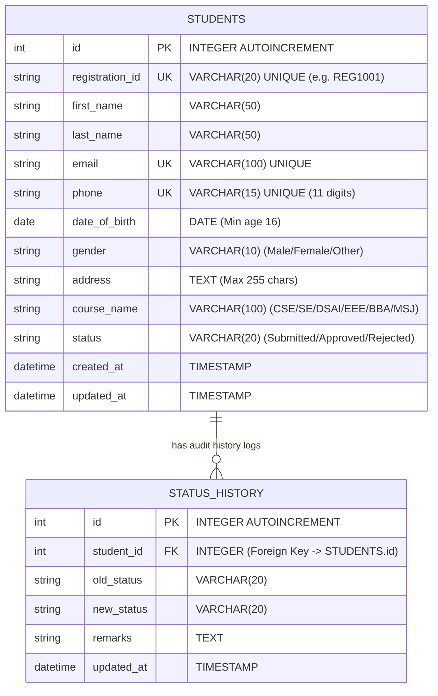

# Entity-Relationship (ER) Diagram

**System:** Student Registration System  
**University:** University Of Liberal Arts Bangladesh (ULAB)

---

## 📐 Graphical Mermaid ER Diagram



---

## 📊 Structural Entity Relationship Layout

```text
+------------------------------------+           +------------------------------------+
|             STUDENTS               |           |           STATUS_HISTORY           |
+------------------------------------+           +------------------------------------+
| PK  id INTEGER AUTOINCREMENT       | 1       N | PK  id INTEGER AUTOINCREMENT       |
| UK  registration_id VARCHAR(20)    |<----------| FK  student_id INTEGER             |
|     first_name VARCHAR(50)         |           |     old_status VARCHAR(20)         |
|     last_name VARCHAR(50)          |           |     new_status VARCHAR(20)         |
| UK  email VARCHAR(100)             |           |     remarks TEXT                   |
| UK  phone VARCHAR(15)              |           |     updated_at TIMESTAMP           |
|     date_of_birth DATE             |           +------------------------------------+
|     gender VARCHAR(10)             |
|     address TEXT                   |
|     course_name VARCHAR(100)       |
|     status VARCHAR(20)             |
|     created_at TIMESTAMP           |
|     updated_at TIMESTAMP           |
+------------------------------------+
```

---

## 🔗 Relationship Cardinality & Business Rules

1. **One-to-Many Relationship (1 : N):**
   - Each `STUDENTS` record can have **multiple** entries in the `STATUS_HISTORY` table tracking every status transition (e.g. `N/A -> Submitted`, `Submitted -> Approved`).
   - Each `STATUS_HISTORY` entry belongs strictly to **one** student via the Foreign Key `student_id` referencing `students(id)`.

2. **Cascading Rule:**
   - `ON DELETE CASCADE`: If a student record is deleted, all corresponding status history logs are automatically purged.
